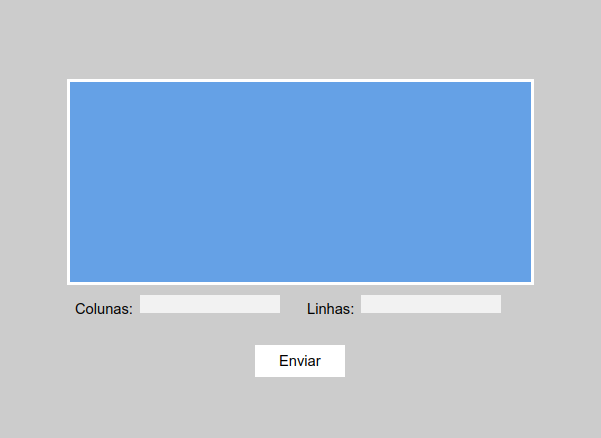

# Desafio
Desenvolva uma página web, em JavaScript puro, com o seguinte Wireframe:

- Temos inputs de texto Colunas e Linhas, e em azul temos um bloco.

- Ao inserir valores numéricos nos campos e em seguida apertar enviar, o bloco superior é alterado.

- Se for inserido o valor 1 em Colunas e o valor 2 em Linhas, o bloco deverá ser dividido em 1 coluna e 2 linhas.

- Se for inserido o valor 7 em Colunas e o valor 3 em Linhas, o bloco deverá ser dividido em 7 coluna e 3 linhas.

- É importante que os valores inseridos nos campos colunas e linhas aceitem diferentes variações do que os dois exemplos acima.